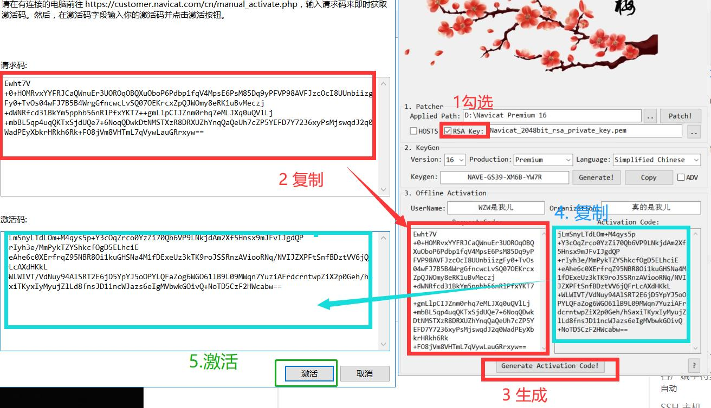
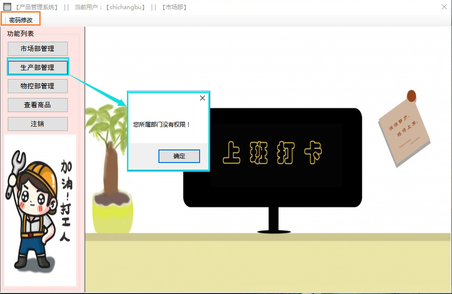

## 开发介绍

> Author : 【XcNgg】
>
> Blog : www.xcup.top
>
> Email: XiaoCaoNgg@Gmail.com
>
> 百度网盘链接：https://pan.baidu.com/s/1yhYbvAVRpYnhWWiWmjJtiQ  提取码：21lf 

## 项目简介

> 基于`C#`与`MySQL`开发的简易生产管理系统
>
> 【内容实现】
>
> - 用户
>   - 登录权限分割
>     - 0 管理员
>     - 1 市场部
>     - 2 生产部
>     - 3 物控部
>     - 4 游客
>   - 匿名访问
>   - 用户修改
>   - 用户查询
>   - 用户添加
>   - 用户删除
> - 订单
>   - 订单修改
>   - 订单生成
>   - 订单查询
>   - 订单删除
> - 产品
>   - 产品查询
>   - 产品修改
>   - 产品删除
>   - 产品添加
> - 客户
>   - 客户查询
>   - 客户添加
>   - 客户删除
>   - 客户修改

## 开发环境

-  `Visual Studio Community 2022 `
  
  - `.NET 4.8` 
  
- `MySQL-Connector-Net-8.0.29`

  - 开发需要.Net 4.8的支持

- `MySQL 5.6.50 `

  - 基于云服务器搭建

  - 详细信息

    ```python
    mysql_config = {
        "user": "CSharp",
        "password": 'CSharp',
        "host": "203.25.208.205",
        "db": "csharp",
        "charset": "utf8mb4"
    }
    ```

- `Python 3.10`

  - 自动生成插入订单伪数据
  - 依赖库
    - `pymysql ` 连接数据库，数据查询与存储
    - `faker`  生成伪数据
    - `requests`  构造请求，爬取网页数据
    - `lxml  `产品数据解析
    - `random  `随机生成数据
    - `datetime  `时间格式化存储

- Navicat 16 

  -  连接数据库
  -  制库制表

## 目录介绍

以下为重要文件介绍：

>----./ `【当前目录】`
>|----Business by.py `【Python脚本,用于生成海量订单，产品，客户】`
>|----数据库备份.sql `【数据库备份文件，如果云数据库失效,需自己搭建数据库，直接执行sql语句即可生成数据】`
>|----MySQL引用/ `【开发引用文件】`
>|    |----MySql.Data.dll `【C#开发需要引用的文件】 `
>|    |----MySqlHelper.cs `【C#开发需要引用的文件】`
>|----MySQL驱动安装/`【必装环境】`
>|    |----mysql-connector-net-8.0.29.msi `【EXE运行前必须安装的驱动】`
>|----ProductSystem.exe `【生成的EXE文件】` 
>|----ProductSystem_over.zip `【项目源码】`
>|----其他环境/`【存放开发环境,可以选择安装与否】`
>|    |----Navicat 16/`【Navicat 数据库管理工具】`
>|    |    |----Navicat16 Cracker.exe `【激活工具】`
>|    |    |----navicat160_premium_cs_x64.exe `【Navicat 16 安装包】`
>|    |    |----Navicat_2048bit_rsa_private_key.pem `【激活密钥】`
>|    |----ndp48-devpack-chs.exe `【.NET 4.8 安装包】`
>|    |----python-3.10.4-amd64.exe `【Python 3.10 安装包】`
>|    |----VisualStudioSetup.exe `【Visual Studio 2022 安装包 】`
>|----简易生成管理系统.md `【简介文件】`
>|----项目图标素材/ `【产品 文档图片依赖随材】`
>|    |---- ..... 

##  Visual Studio 开发准备

### 一 、安装`mysql-connector-net-8.0.29`【必装驱动】

**注意！这步必须完成！否则运行EXE软件会缺失依赖文件！如下图**


**注意！这步必须完成！否则运行EXE软件会缺失依赖文件！如上图**

**注意！这步必须完成！否则运行EXE软件会缺失依赖文件！如上图**


双击打开`MySQL驱动安装`目录下的`mysql-connector-net-8.0.29.msi`

点击`Next`


点击`Typical`


点击`Install`

等待安装完成即可

### 二、安装  .NET 4.8 【开发需求】

由于机房的`Visual Studio 2012`和 `Visual Studio 2010` 框架最高是`.NET 4.0`

而`Visual Studio 2022` 默认使用的是`.NET 4.8 `框架

且`mysql-connector-net-8.0.29`需要依托于`.NET 4.5`及以上的框架

在机房使用`Visual Studio 2010`或`Visual Studio 2012`开发该项目会存在项目不兼容的问题，需要我们手动安装`.NET 4.8`框架，但是`.NET 4.8` 安装完成后需要重启生效，而机房又存在重启恢复的问题，因此不建议在机房进行调试开发该项目

> 如果有需要，可以查看如下链接：

[点击下载  .NET Framework 4.8 Developer Pack Offline Installer【官方下载】](https://dotnet.microsoft.com/zh-cn/download/dotnet-framework/thank-you/net48-developer-pack-offline-installer)

[点击下载  .NET Framework 4.8 Developer Pack - CHS Language Pack 【官方下载】](https://dotnet.microsoft.com/zh-cn/download/dotnet-framework/thank-you/net48-developer-pack-chs)

[点击查看  .NET 其他框架  【官方网站】](https://dotnet.microsoft.com/zh-cn/download/visual-studio-sdks?utm_source=getdotnetsdk&utm_medium=referral)

### 三、安装  Visual Studio 2022 【开发IDE】

可以选择`其他环境`目录下的`VisualStudioSetup.exe`进行安装，该版本为`Community 2022` 

> 其他版本下载：[Visual Studio 2022 官网下载](https://visualstudio.microsoft.com/zh-hans/vs/)

### 四、Python 3.X 安装【附带脚本】

如果您需要大量数据

我为您提供了插入数据库的脚本`伪数据生成插入数据库.py`

在此之前，需要正确的安装`Python3.x`环境

您可以选择在`其他环境`目录下的`python-3.10.4-amd64.exe`进行安装`Python`，该版本为`3.10`

**注意！一定要勾选 `Add Python to PATH `可以减少不必要的环境变量配置**

> 其他版本下载 :  [Python 官网下载](https://www.python.org/downloads/)

#### 1. 更新PIP

安装完毕后，需要您正确的使用`CMD`安装依赖库

- `WIN`+`R`输入`CMD`打开

- 更新`PIP`

  ```powershell
  pip install -U pip -i  https://pypi.tuna.tsinghua.edu.cn/simple
  ```

  出现如下更新成功

  

#### 2. 安装依赖库

```powershell
pip install pymysql faker requests lxml -i https://pypi.tuna.tsinghua.edu.cn/simple
```

出现如下，即安装成功

> *`Successfully installed faker-13.11.1 lxml-4.8.0 pymysql-1.0.2 python-dateutil-2.8.2 six-1.16.0`*


#### 3. 脚本演示


在`CMD`终端中输入`python .\Business by.py`即可运行

目前提供需求如下

**输入对应的序号可以得到对应的需求**

*---如果当前数据表为空,请先添加客户，再添加产品,最后添加订单---*

```python
---请输入对应需求对应的序号---
---如果当前数据表为空,请先添加客户，再添加产品,最后添加订单---
【0】 退出
【1】 添加新客户
【2】 添加摩托产品
	# 来源 https://www.2smoto.com/pinpai.asp
【3】 添加新订单与详细信息
【4】 添加所属订单
【5】 添加豆瓣书籍
	# 来源 https://book.douban.com/top250?start=
【6】 添加笔趣阁小说
	# 来源 https://www.xbiquge.so/top/allvisit/
【7】 添加手机产品
	# 来源 https://product.pconline.com.cn/mobile/
【8】 添加笔记本/平板产品[无页数控制]
	# 来源 https://product.pconline.com.cn/notebook/
【9】 添加电脑配件产品
	# 来源 https://product.pconline.com.cn/pc/
```

> 产品添加均采用网络爬虫技术，过度使用由使用者负全责，与作者无关

### 五、Navicat 16 【数据库管理】

#### 1 . 安装

双击`其他环境`目录下`Navicat 16/navicat160_premium_cs_x64.exe`进行安装


选择安装路径，一直下一步安装完成

#### 2. hosts 修改

安装完成后，不要着急打开Navicat 16

**以管理员的身份用记事本打开`C:\Windows\System32\drivers\etc\hosts`文件，在文件末尾添加如下任意一段**

```python
127.0.0.1       activate.navicat.com
或者
0.0.0.0       activate.navicat.com
```


**最后以管理员身份保存即可关闭**

#### 3. Cracker 激活

双击`其他环境`目录下`Navicat 16/Navicat16 Cracker.exe`进行破解


然后打开`Navicat 16`

首次登录会自动需要注册，如果不小心错过了，可以在帮助里注册


而后打开激活工具，将生成的激活码复制进去


**在弹出的框中点击`手动激活`**



根据上述步骤激活完毕


如此即可

#### 4. 开始使用


```python
连接名 ： 随意
主机 ： 203.25.208.205 
端口： 3306 
用户名：CSharp
密码：CSharp
```


连接成功，如此则可以查看数据表的内容

## MySQL结构

> 简单的设计了一下表的结构，只满足系统的基本需求

### 1、User 结构

> `存储用户登录的账号密码`

| 字段名       | 类型    | 长度 | 备注                                                         |
| :----------- | ------- | ---- | ------------------------------------------------------------ |
| UserId       | int     | 10   | 用户ID                                                       |
| UserName     | varchar | 100  | 用户名                                                       |
| UserPassword | varchar | 100  | 用户密码                                                     |
| UserRole     | int     | 10   | 用户权限<br/>0 管理员<br/>1 市场部<br/>2 生产部<br/>3 物控部<br/>4 匿名 |

###  2、Client 结构

> `客户表，用于存储客户的信息`


| 字段名             | 类型    | 长度 | 备注     |
| ------------------ | ------- | ---- | -------- |
| ClientId           | int     | 10   | 客户ID   |
| ClientName         | varchar | 20   | 客户名称 |
| ClientAbbreviation | varchar | 20   | 客户简称 |
| ClientContacts     | varchar | 20   | 联系人   |
| ClientTelephone    | varchar | 15   | 电话     |
| ClientAddress      | varchar | 50   | 地址     |
| ClientEmail        | varchar | 40   | 邮箱     |

### 3、Order_info 结构

> `存储订单信息`


| 字段名       | 类型     | 长度 | 备注     |
| ------------ | -------- | ---- | -------- |
| OrderId      | int      | 10   | 订单ID   |
| ClientName   | varchar  | 20   | 客户名称 |
| OrderState   | varchar  | 20   | 订单状态 |
| OrderData    | datetime |      | 下单时间 |
| PlannedDate  | datetime |      | 预计交期 |
| DeliveryDate | datetime |      | 发货时间 |
| OrderNotes   | varchar  | 100  | 备注     |

### 4、OrderDetail结构

> `用于存储订单的详细信息内容`


| 字段名      | 类型    | 长度 | 备注     |
| ----------- | ------- | ---- | -------- |
| OrderId     | int     | 11   | 订单ID   |
| ItemNo      | varchar | 11   | 货号     |
| OrderNumber | int     | 11   | 订单数量 |
| Quantity    | int     | 6    | 单价     |
| ItemState   | varchar | 10   | 货物状态 |
| Mark        | int     | 11   | 标识ID   |

### 5、Product 结构

> `存储在售产品信息`


| 字段名        | 类型    | 长度 | 备注     |
| ------------- | ------- | ---- | -------- |
| ItemNo        | int     | 11   | 货号     |
| ProductName   | varchar | 50   | 产品名称 |
| Description   | varchar | 100  | 详细信息 |
| ProductNumber | int     | 15   | 数量     |
| Price         | int     | 10   | 原价     |

## 使用说明

>1. 有登录功能，用户权限区分功能。对应用户登录后跳转至对应模块，并可以用户进行管理。
>2. 在线下单，可查询历史订单，对于错误订单进行修改。
>3. 订单中可以体现订单状态，订单货号、产品数量、金额、下单时间，发货时间等信息。
>4. 管理客户，客户信息页面中可体现客户简介、联系人、地址、电话等信息。
>5. 产品管理，有产品查询页面，页面中可体现货号、产品名称、产品详细信息、数量等。
>6. 生产管控，生产完成后可在系统中修改订单产品状态。
>7. 后台管理：管理员用户可以配合各部门维护系统

### 登录


可以选择登录方式

- 权限登录

  - 管理员

  - 市场部

  - 生产部

  - 物控部

    实现上述部门的登录

- 无权限登录

  提供无需密码的游客登录

###  权限介绍

####  权限管理


管理员的权限是最大的,可以使用任何功能

当然，最重要的是`后台维护`功能，在功能列表中包含的是各个部门所对应的权限，且各个部门不包含后台维护功能，下面拿市场部和游客进行对比



`当任何部门访问其他部门时，访问会受到无情拒绝`


而选择游客登录时，`只能访问在售商品列表`，访问其他部门则会弹出招聘广告

### 功能实现


后台管理员可以对整个企业系统进行管理

> - 用户信息增删改查
> - 客户信息增删改查
> - 订单增珊改查
> - 订单信息增删改查
> - 在售产品信息增删改查


市场部成员仅仅可以对`订单、订单信息、客户信息进行增删改查`

>- 进入市场部管理系统`默认展示最新订单信息`
>
>- 增、删、改、查 全部订单
>- 增、删、改、查 全部订单信息
>- 增、删、改、查 全部客户信息


生产部成员仅仅可以`查看订单客户、查看全部订单信息、订单商品信息查询修改`

>- 查看全部订单及信息
>- 查看客户订单
>- 对订单商品进行修改


物控部成员仅仅可以对`产品管理,订单信息查看修改，订单发货产品修改`

>- 产品出库，产品入库
>- 查询产品
>- 添加新产品
>- 查看全部订单
>- 发货时间修改
>- 货物状态修改

## 注意事项

> 以上功能均为大体功能，具体实现需要用户手动操作探索

> 如果数据库的密码失效，则需要手动自己搭建数据库，使用`./数据库备份.sql `执行`SQL语句`可以直接生成源数据库
> 且需要更改`./ProductSystem/ProductSystem/MySqlHelper.cs`的连接语句
>
> > ```c#
> >  //数据库连接字符串
> > public static string Conn = "Database='csharp';Data Source='IP地址';User Id='MYSQL用户名';Password='MYSQL密码';charset='utf8';pooling=true;";
> > ```
